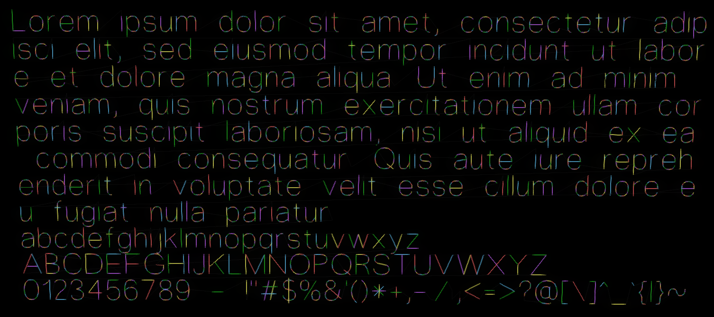

# Text to G-code compiler

This repository contains a Python 3 script that takes a **text file as input** and generates a **2D G-code file as output**. The alphabet contained in the `ascii_gcode` subfolder supports **all ASCII characters** and is used by default, producing letters made up of just **single lines**, like you can see in the image below. The parameters that you can tune are the directory in which to look for the G-code alphabet, the maximum length of a line, the distance between two subsequent lines and the empty space between characters. You can then **use the produced G-code in a 2D plotter**, you may find this other project of mine useful: [plotter](https://github.com/Stypox/plotter).


<sup>Obtained with http://jherrm.com/gcode-viewer/</sup>

## Usage

You can run the script normally with [Python 3](https://www.python.org/downloads/):
```
python3 text_to_gcode.py ARGUMENTS...
```
This is the help screen with all valid arguments (obtainable with `python3 text_to_gcode.py --help`):
```
usage: text_to_gcode.py [-h] [-i FILE] -o FILE [-g DIR] -l LINE_LENGTH [-s LINE_SPACING] [-p PADDING]

Compiles text into 2D gcode for plotters

optional arguments:
  -h, --help            show this help message and exit
  -i FILE, --input FILE
                        File to read characters from
  -o FILE, --output FILE
                        File in which to save the gcode result
  -g DIR, --gcode-directory DIR
                        Directory containing the gcode information for all used characters
  -l LINE_LENGTH, --line-length LINE_LENGTH
                        Maximum length of a line
  -s LINE_SPACING, --line-spacing LINE_SPACING
                        Distance between two subsequent lines
  -p PADDING, --padding PADDING
                        Empty space between characters
```

The required parameters are the input, the output and the line length (in order to tune this last parameter, note that the average width of a character is ~4.5).

An example of command is:
```sh
python3 --input input.txt --output output.nc --line-length 300 --line-spacing 10 --padding 3
```